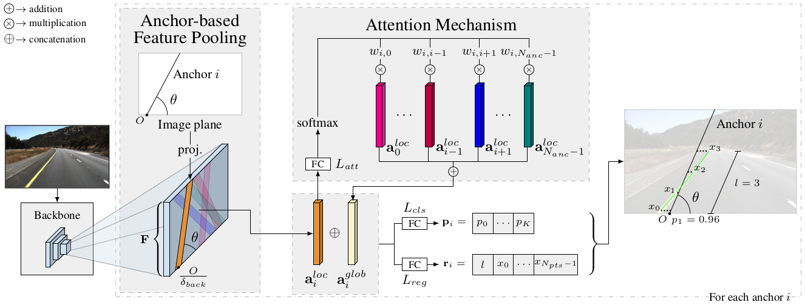
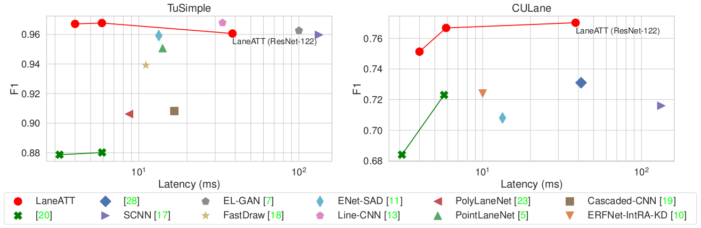
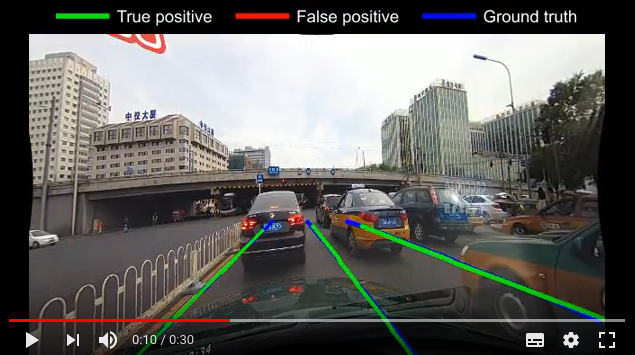
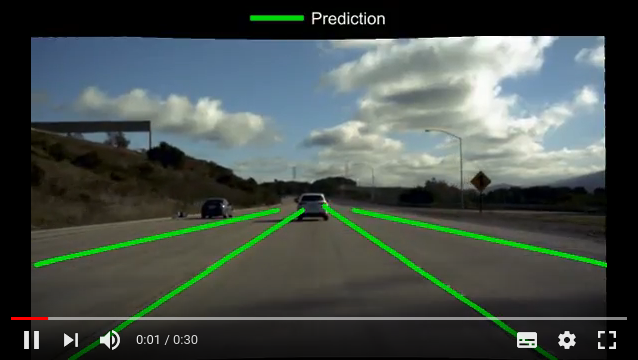

<div align="center">

# LaneATT
[](https://arxiv.org/abs/2010.12035)
[](https://openaccess.thecvf.com/content/CVPR2021/html/Tabelini_Keep_Your_Eyes_on_the_Lane_Real-Time_Attention-Guided_Lane_Detection_CVPR_2021_paper.html)

</div>

This repository holds the source code for LaneATT, a novel state-of-the-art lane detection model proposed in the [paper](https://arxiv.org/abs/2010.12035) "_Keep your Eyes on the Lane: Real-time Attention-guided Lane Detection_", by [Lucas Tabelini](https://github.com/lucastabelini), [Rodrigo Berriel](http://rodrigoberriel.com), [Thiago M. Paixão](https://sites.google.com/view/thiagopx), [Claudine Badue](http://www.inf.ufes.br/~claudine/), [Alberto F. De Souza](http://www.lcad.inf.ufes.br/team/index.php/Prof._Dr._Alberto_Ferreira_De_Souza), and [Thiago Oliveira-Santos](http://www.inf.ufes.br/~todsantos/home).

**News (2021-03-01)**: Our paper presenting LaneATT has been accepted to CVPR'21.

### Table of contents
1. [Prerequisites](#1-prerequisites)
2. [Install](#2-install)
3. [Getting started](#3-getting-started)
4. [Results](#4-results)
5. [Code structure](#5-code-structure)
6. [Citation](#6-Citation)


### 1. Prerequisites
- Python >= 3.5
- PyTorch == 1.6, tested on CUDA 10.2. The models were trained and evaluated on PyTorch 1.6. When testing with other versions, the results (metrics) are slightly different.
- CUDA, to compile the NMS code
- Other dependencies described in `requirements.txt`

The versions described here were the lowest the code was tested with. Therefore, it may also work in other earlier versions, but it is not guaranteed (e.g., the code might run, but with different outputs).

### 2. Install
Conda is not necessary for the installation, as you can see, I only use it for PyTorch and Torchvision.
Nevertheless, the installation process here is described using it.

```bash
conda create -n laneatt python=3.8 -y
conda activate laneatt
conda install pytorch==1.6 torchvision -c pytorch
pip install -r requirements.txt
cd lib/nms; python setup.py install; cd -
```

### 3. Getting started
#### Datasets
For a guide on how to download and setup each dataset, see [DATASETS.md](DATASETS.md).

#### Training & testing
Train a model:
```
python main.py train --exp_name example --cfg example.yml
```
For example, to train LaneATT with the ResNet-34 backbone on TuSimple, run:
```
python main.py train --exp_name laneatt_r34_tusimple --cfg cfgs/laneatt_tusimple_resnet34.yml
```
After running this command, a directory `experiments` should be created (if it does not already exists). Another
directory `laneatt_r34_tusimple` will be inside it, containing data related to that experiment (e.g., model checkpoints, logs, evaluation results, etc)

Evaluate a model:
```
python main.py test --exp_name example
```
This command will evaluate the model saved in the last checkpoint of the experiment `example` (inside `experiments`).
If you want to evaluate another checkpoint, the `--epoch` flag can be used. For other flags, please see `python main.py -h`. To **visualize the predictions**, run the above command with the additional flag `--view all`.

#### Reproducing a result from the paper
0. Set up the dataset you want to reproduce the results on (as described in [DATASETS.md](DATASETS.md)).
1. Download the zip containing all pretrained models  and then unzip it at the code's root:
```bash
gdown "https://drive.google.com/uc?id=1R638ou1AMncTCRvrkQY6I-11CPwZy23T" # main experiments on TuSimple, CULane and LLAMAS (1.3 GB)
unzip laneatt_experiments.zip
```
2. Run the evaluation (inference + metric computation):
```bash
python main.py test --exp_name $EXP_NAME
```
Replace `$EXP_NAME` with the name of a directory inside `experiments/`. For instance, if you want to reproduce the results using the ResNet-34 backbone on the TuSimple dataset, run:
```bash
python main.py test --exp_name laneatt_r34_tusimple
```
The results on TuSimple and LLAMAS should match exactly the ones reported in the paper. The results on CULane will deviate in the order of 0.1% (as shown in the CULane table below), since the metric reported on the paper was computed with the official code (C++), while this script will compute it using our implementation (which is much faster and in Python). The official metric implementation is available [here](https://github.com/XingangPan/SCNN/tree/master/tools/lane_evaluation).

### 4. Results


#### CULane

|   Backbone    |        F1, official impl. (%)      | F1, our impl. (%) | FPS |
|     :---      |         ---:                       |   ---:            | ---:|
| ResNet-18     | 75.13                              |  75.08            | 250 |
| ResNet-34     | 76.68                              |  76.66            | 171 |
| ResNet-122    | 77.02                              |  77.02            | 26 |

"F1, official impl." refers to the official CULane metric implementation in C++. "F1, our impl" refers to our implementation of the metric in Python. The results reported in the paper were computed using the [official metric implementation](https://github.com/XingangPan/SCNN/tree/master/tools/lane_evaluation)
 (requires OpenCV 2.4).
 [](https://youtu.be/ghs93acwkBQ)

#### TuSimple
|   Backbone    |      Accuracy (%)     |      FDR (%)     |      FNR (%)     |      F1 (%)     | FPS |
|    :---       |         ---:          |       ---:       |       ---:       |      ---:       | ---:|
| ResNet-18     |    95.57              |    3.56          |    3.01          |    96.71        | 250 |
| ResNet-34     |    95.63              |    3.53          |    2.92          |    96.77        | 171 |
| ResNet-122    |    96.10              |    4.64          |    2.17          |    96.06        | 26 |

Since the TuSimple dataset is not sequential, no qualitative video is available.

#### LLAMAS
|   Backbone    |      F1 (%)     |   Precision (%)  |   Recall (%)  | FPS |
|    :---       |         ---:    |       ---:       |       ---:    | ---:|
| ResNet-18     |      93.46      |     96.92        |    90.24      | 250 |
| ResNet-34     |      93.74      |     96.79        |    90.88      | 171 |
| ResNet-122    |      93.54      |     96.82        |    90.47      | 26 |

 [](https://youtu.be/1f_y4A-muMg)

Additional results can be seen in the paper.

### 5. Code structure
- **cfgs:** Default configuration files
- **figures:** Images used in this repository
- **lib**
  - **datasets**
    - **culane.py:** CULane annotation loader
    - **lane_dataset.py:** Transforms raw annotations from a `LaneDatasetLoader` into a format usable by the model
    - **lane_dataset_loader.py:** Abstract class that each dataset loader implements
    - **llamas.py:** LLAMAS annotation loader
    - **nolabel_dataset.py:** Used on data with no annotation available (or quick qualitative testing)
    - **tusimple.py:** TuSimple annotation loader
   - **models:**
     - **laneatt.py:** LaneATT implementation
     - **matching.py:** Utility function for ground-truth and proposals matching
     - **resnet.py:** Implementation of ResNet
  - **nms:** NMS implementation
  - **config.py:** Configuration loader
  - **experiment.py:** Tracks and stores information about each experiment
  - **focal_loss.py:** Implementation of Focal Loss
  - **lane.py:** Lane representation
  - **runner.py:** Training and testing loops
- **utils**:
  - **culane_metric.py:** Unofficial implementation of the CULane metric. This implementation is faster than the oficial,
  however, it does not matches exactly the results of the official one (error in the order of 1e-4). Thus, it was used only during the model's development.
  For the results reported in the paper, the official one was used.
  - **gen_anchor_mask.py**: Computes the frequency of each anchor in a dataset to be used in the anchor filtering step
  - **gen_video.py:** Generates a video from a model's predictions
  - **llamas_metric.py**: Official implementation of the LLAMAS metric
  - **llamas_utils.py**: Utilities functions for the LLAMAS dataset
  - **speed.py:** Measure efficiency-related metrics of a model
  - **tusimple_metric.py**: Official implementation of the TuSimple metric
  - **viz_dataset.py**: Show images sampled from a dataset (post-augmentation)
- **main.py:** Runs the training or testing phase of an experiment

### 6. Citation
If you use this code in your research, please cite:

```bibtex
@InProceedings{tabelini2021cvpr,
  author    = {Lucas Tabelini
               and Rodrigo Berriel
               and Thiago M. Paix\~ao
               and Claudine Badue
               and Alberto Ferreira De Souza
               and Thiago Oliveira-Santos},
  title     = {{Keep your Eyes on the Lane: Real-time Attention-guided Lane Detection}},
  booktitle = {Conference on Computer Vision and Pattern Recognition (CVPR)},
  year      = {2021}
}
```
