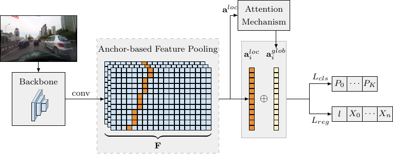

# LaneATT

This repository will hold the source code for LaneATT, a novel state-of-the-art lane detection model proposed in the [paper](https://arxiv.org/abs/2010.12035) "_Keep your Eyes on the Lane: Real-time Attention-guided Lane Detection_", by [Lucas Tabelini](https://github.com/lucastabelini), [Rodrigo F. Berriel](http://rodrigoberriel.com), [Thiago M. Paixão](https://sites.google.com/view/thiagopx), [Claudine Badue](https://www.inf.ufes.br/~claudine/), [Alberto F. De Souza](https://inf.ufes.br/~alberto), and [Thiago Oliveira-Santos](https://www.inf.ufes.br/~todsantos/home).

**The code will be published soon. Subscribe to [this issue](https://github.com/lucastabelini/LaneATT/issues/1) to be notified when that happens.**

### Abstract

Modern lane detection methods have achieved remarkable performances in complex real-world scenarios, but many have issues maintaining real-time efficiency, which is important for autonomous vehicles. In this work, we propose LaneATT: an anchor-based deep lane detection model, which, akin to other generic deep object detectors, uses the anchors for the feature pooling step. Since lanes follow a regular pattern and are highly correlated, we hypothesize that in some cases global information may be crucial to infer their positions, especially in conditions such as occlusion, missing lane markers, and others. Thus, this work proposes a novel anchor-based attention mechanism that aggregates global information. The model was evaluated extensively on three of the most widely used datasets in the literature. The results show that our method outperforms the current state-of-the-art methods showing both higher efficacy and efficiency. Moreover, an ablation study is performed along with a discussion on efficiency trade-off options that are useful in practice.
